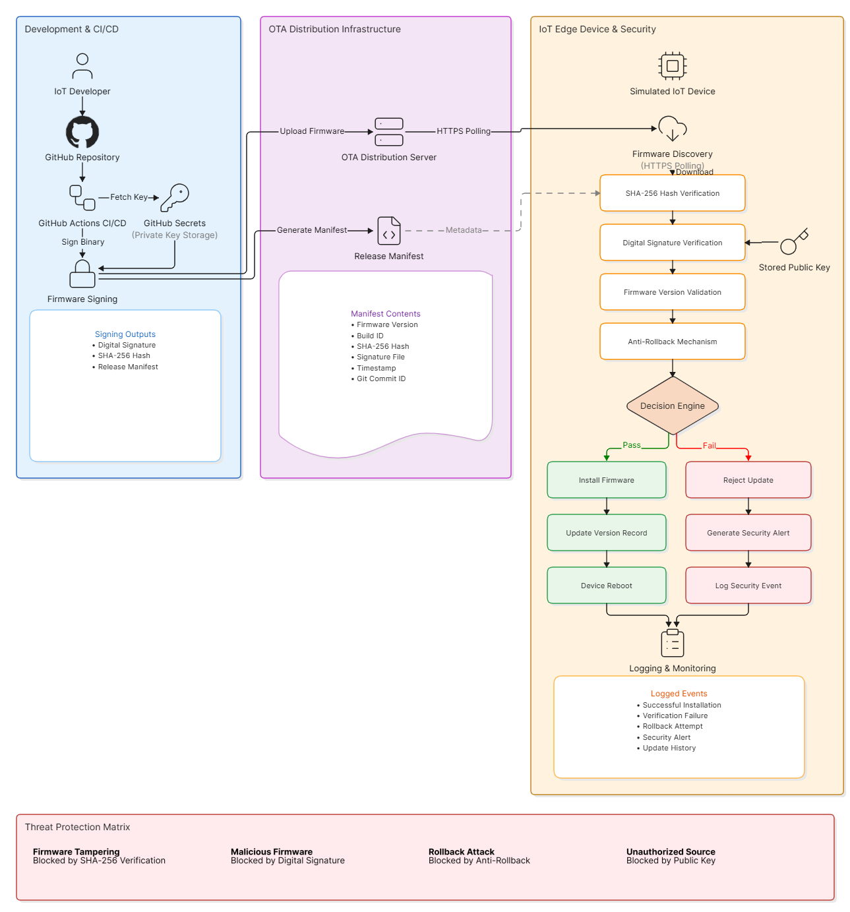

# OTA Firmware Update Architecture Diagram

## Overview

This architecture diagram illustrates the Secure OTA Firmware Update and Code Signing Infrastructure for IoT Edge Devices.

The system ensures that firmware updates are securely built, signed, distributed, verified, and installed.

---

## Main Components

### Development & CI/CD

- IoT Developer
- GitHub Repository
- GitHub Actions CI/CD
- GitHub Secrets
- Firmware Signing Module

### OTA Distribution Infrastructure

- OTA Distribution Server
- Release Manifest

### IoT Edge Device & Security

- Firmware Discovery
- SHA-256 Hash Verification
- Digital Signature Verification
- Firmware Version Validation
- Anti-Rollback Mechanism
- Decision Engine
- Logging & Monitoring

---

## Security Controls

The architecture implements:

- SHA-256 Integrity Verification
- Digital Signature Verification
- Public Key Validation
- Firmware Version Validation
- Anti-Rollback Protection

---

## Threat Protection

| Threat              | Protection                     |
| ------------------- | ------------------------------ |
| Firmware Tampering  | SHA-256 Verification           |
| Malicious Firmware  | Digital Signature Verification |
| Rollback Attack     | Anti-Rollback Mechanism        |
| Unauthorized Source | Public Key Verification        |

---

## Architecture Diagram

